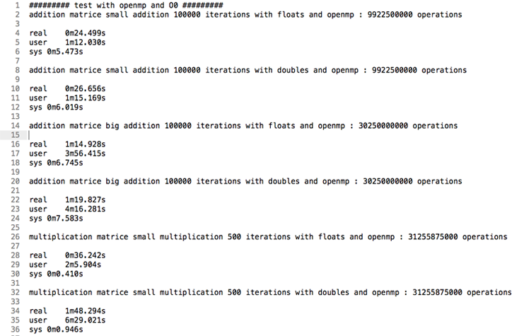
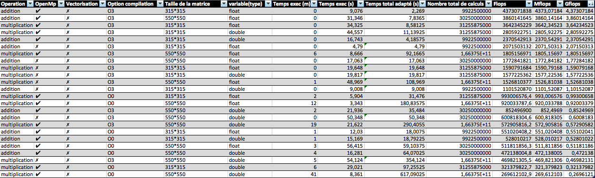
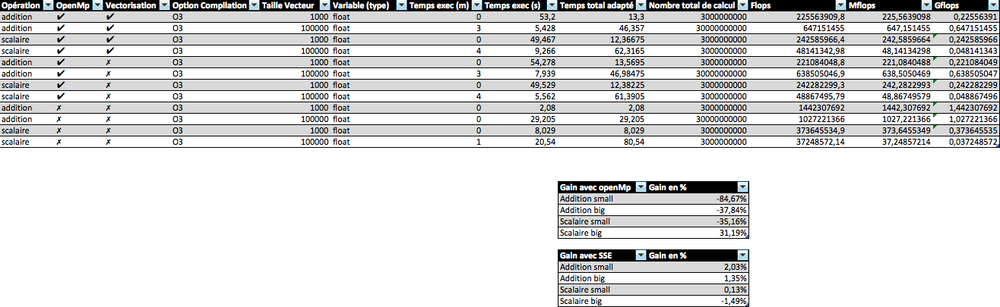

# MN - TP2 Compte rendu #
- NOGUERON Matthieu
- VIAL-GRELIER Aymeric

## Utilisation de l'application ##

    make
    ./target/debug/gen_aleat [nb elements][filename]
    ./target/debug/test_matrix_[small/big] [a/m/s/t/g (choix de l'opération)] [int (itérations)] [d/f (double/float)]

Afin d'éffectuer un test des performances de l'application un script .sh est à disposition. Pour l'éxécuter ./script_perfs.sh. Afin de personaliser les tests il est possible de changer les valeurs des itérations dans le script .sh.

** ATTENTION **

Si jamais le script `.sh`est interrompu avant la fin de son execution, il vous faudra par précaution lancer le script `restore.sh` afin de restaurer les Makefiles.

    ADD_LOOP=X (valeur souhaitée d'itérations / par défaut 100 000);
    MULT_LOOP=Y (valeur souhaitée d'iterations / par défaut 500);

Ce script compile tout seul l'application et la lance afin de faire les tests sur :
1. addition / openmp / matrices en cache / -O0
* addition / openmp / matrices pas en cache / -O0
* addition / openmp / matrices en cache / -O3
* addition / openmp / matrices pas en cache / -O3
* addition / pas openmp / matrices pas en cache / -O3
* addition / pas openmp / matrices en cache / -O3
* multiplication / openmp / matrices en cache / -O0
* multiplication / openmp / matrices pas en cache / -O0
* multiplication / openmp / matrices en cache / -O3
* multiplication / openmp / matrices pas en cache / -O3
* multiplication / pas openmp / matrices pas en cache / -O3
* multiplication / pas openmp / matrices en cache / -O3
* factorisation LU openMp / -O3 / matrices en cache
* factorisation LU openMp / -O3 / matrices pas en cache
* factorisation LU pas openMp / -O3 / matrices en cache
* factorisation LU pas openMp / -O3 / matrices pas en cache
* addition / pas openmp / matrices pas en cache / -O3/ SSE
* addition / pas openmp / matrices en cache / -O3/ SSE
* multiplication / pas openmp / matrices pas en cache / -O3 / SSE
* multiplication / pas openmp / matrices en cache / -O3 / SSE

Ce script génère en outre un fichier perfs.txt ressemblant à ceci :

Ceci permet en outre d'avoir une vue d'ensemble sur les différentes options et constater la différence entre les résultats.

## Présentation de la machine de tests
Voici la machine utilisée lors des tests :

    processor       : 0
    vendor_id       : AuthenticAMD
    cpu family      : 21
    model           : 16
    model name      : AMD A8-4500M APU with Radeon(tm) HD Graphics
    stepping        : 1
    microcode       : 0x6001116
    cpu MHz         : 1400.000
    cache size      : 2048 KB
    physical id     : 0
    siblings        : 4
    core id         : 0
    cpu cores       : 2
    apicid          : 16
    initial apicid  : 0
    fpu             : yes
    fpu_exception   : yes
    cpuid level     : 13
    wp              : yes
    flags           : fpu vme de pse tsc msr pae mce cx8 apic sep mtrr pge mca cmov pat pse36 clflush mmx fxsr sse sse2 ht syscall nx mmxext fxsr_opt pdpe1gb rdtscp lm constant_tsc rep_good nopl nonstop_tsc extd_apicid aperfmperf pni pclmulqdq monitor ssse3 fma cx16 sse4_1 sse4_2 popcnt aes xsave avx f16c lahf_lm cmp_legacy svm extapic cr8_legacy abm sse4a misalignsse 3dnowprefetch osvw ibs xop skinit wdt lwp fma4 tce nodeid_msr tbm topoext perfctr_core perfctr_nb arat cpb hw_pstate npt lbrv svm_lock nrip_save tsc_scale vmcb_clean flushbyasid decodeassists pausefilter pfthreshold vmmcall bmi1
    bogomips        : 3793.26
    TLB size        : 1536 4K pages
    clflush size    : 64
    cache_alignment : 64
    address sizes   : 48 bits physical, 48 bits virtual
    power management: ts ttp tm 100mhzsteps hwpstate cpb eff_freq_ro

    processor       : 1
    vendor_id       : AuthenticAMD
    cpu family      : 21
    model           : 16
    model name      : AMD A8-4500M APU with Radeon(tm) HD Graphics  
    stepping        : 1
    microcode       : 0x6001116
    cpu MHz         : 1400.000
    cache size      : 2048 KB
    physical id     : 0
    siblings        : 4
    core id         : 1
    cpu cores       : 2
    apicid          : 17
    initial apicid  : 1
    fpu             : yes
    fpu_exception   : yes
    cpuid level     : 13
    wp              : yes
    flags           : fpu vme de pse tsc msr pae mce cx8 apic sep mtrr pge mca cmov pat pse36 clflush mmx fxsr sse sse2 ht syscall nx mmxext fxsr_opt pdpe1gb rdtscp lm constant_tsc rep_good nopl nonstop_tsc extd_apicid aperfmperf pni pclmulqdq monitor ssse3 fma cx16 sse4_1 sse4_2 popcnt aes xsave avx f16c lahf_lm cmp_legacy svm extapic cr8_legacy abm sse4a misalignsse 3dnowprefetch osvw ibs xop skinit wdt lwp fma4 tce nodeid_msr tbm topoext perfctr_core perfctr_nb arat cpb hw_pstate npt lbrv svm_lock nrip_save tsc_scale vmcb_clean flushbyasid decodeassists pausefilter pfthreshold vmmcall bmi1
    bogomips        : 3793.26
    TLB size        : 1536 4K pages
    clflush size    : 64
    cache_alignment : 64
    address sizes   : 48 bits physical, 48 bits virtual
    power management: ts ttp tm 100mhzsteps hwpstate cpb eff_freq_ro

    processor       : 2
    vendor_id       : AuthenticAMD
    cpu family      : 21
    model           : 16
    model name      : AMD A8-4500M APU with Radeon(tm) HD Graphics  
    stepping        : 1
    microcode       : 0x6001116
    cpu MHz         : 1400.000
    cache size      : 2048 KB
    physical id     : 0
    siblings        : 4
    core id         : 2
    cpu cores       : 2
    apicid          : 18
    initial apicid  : 2
    fpu             : yes
    fpu_exception   : yes
    cpuid level     : 13
    wp              : yes
    flags           : fpu vme de pse tsc msr pae mce cx8 apic sep mtrr pge mca cmov pat pse36 clflush mmx fxsr sse sse2 ht syscall nx mmxext fxsr_opt pdpe1gb rdtscp lm constant_tsc rep_good nopl nonstop_tsc extd_apicid aperfmperf pni pclmulqdq monitor ssse3 fma cx16 sse4_1 sse4_2 popcnt aes xsave avx f16c lahf_lm cmp_legacy svm extapic cr8_legacy abm sse4a misalignsse 3dnowprefetch osvw ibs xop skinit wdt lwp fma4 tce nodeid_msr tbm topoext perfctr_core perfctr_nb arat cpb hw_pstate npt lbrv svm_lock nrip_save tsc_scale vmcb_clean flushbyasid decodeassists pausefilter pfthreshold vmmcall bmi1
    bogomips        : 3793.26
    TLB size        : 1536 4K pages
    clflush size    : 64
    cache_alignment : 64
    address sizes   : 48 bits physical, 48 bits virtual
    power management: ts ttp tm 100mhzsteps hwpstate cpb eff_freq_ro

    processor       : 3
    vendor_id       : AuthenticAMD
    cpu family      : 21
    model           : 16
    model name      : AMD A8-4500M APU with Radeon(tm) HD Graphics  
    stepping        : 1
    microcode       : 0x6001116
    cpu MHz         : 1400.000
    cache size      : 2048 KB
    physical id     : 0
    siblings        : 4
    core id         : 3
    cpu cores       : 2
    apicid          : 19
    initial apicid  : 3
    fpu             : yes
    fpu_exception   : yes
    cpuid level     : 13
    wp              : yes
    flags           : fpu vme de pse tsc msr pae mce cx8 apic sep mtrr pge mca cmov pat pse36 clflush mmx fxsr sse sse2 ht syscall nx mmxext fxsr_opt pdpe1gb rdtscp lm constant_tsc rep_good nopl nonstop_tsc extd_apicid aperfmperf pni pclmulqdq monitor ssse3 fma cx16 sse4_1 sse4_2 popcnt aes xsave avx f16c lahf_lm cmp_legacy svm extapic cr8_legacy abm sse4a misalignsse 3dnowprefetch osvw ibs xop skinit wdt lwp fma4 tce nodeid_msr tbm topoext perfctr_core perfctr_nb arat cpb hw_pstate npt lbrv svm_lock nrip_save tsc_scale vmcb_clean flushbyasid decodeassists pausefilter pfthreshold vmmcall bmi1
    bogomips        : 3793.26
    TLB size        : 1536 4K pages
    clflush size    : 64
    cache_alignment : 64
    address sizes   : 48 bits physical, 48 bits virtual
    power management: ts ttp tm 100mhzsteps hwpstate cpb eff_freq_ro

Et la version du compilateur utilisé :

    Using built-in specs.
    COLLECT_GCC=gcc
    COLLECT_LTO_WRAPPER=/usr/lib/gcc/x86_64-linux-gnu/4.8/lto-wrapper
    Target: x86_64-linux-gnu
    Configured with: ../src/configure -v --with-pkgversion='Ubuntu 4.8.2-19ubuntu1' --with-bugurl=file:///usr/share/doc/gcc-4.8/README.Bugs --enable-languages=c,c++,java,go,d,fortran,objc,obj-c++ --prefix=/usr --program-suffix=-4.8 --enable-shared --enable-linker-build-id --libexecdir=/usr/lib --without-included-gettext --enable-threads=posix --with-gxx-include-dir=/usr/include/c++/4.8 --libdir=/usr/lib --enable-nls --with-sysroot=/ --enable-clocale=gnu --enable-libstdcxx-debug --enable-libstdcxx-time=yes --enable-gnu-unique-object --disable-libmudflap --enable-plugin --with-system-zlib --disable-browser-plugin --enable-java-awt=gtk --enable-gtk-cairo --with-java-home=/usr/lib/jvm/java-1.5.0-gcj-4.8-amd64/jre --enable-java-home --with-jvm-root-dir=/usr/lib/jvm/java-1.5.0-gcj-4.8-amd64 --with-jvm-jar-dir=/usr/lib/jvm-exports/java-1.5.0-gcj-4.8-amd64 --with-arch-directory=amd64 --with-ecj-jar=/usr/share/java/eclipse-ecj.jar --enable-objc-gc --enable-multiarch --disable-werror --with-arch-32=i686 --with-abi=m64 --with-multilib-list=m32,m64,mx32 --with-tune=generic --enable-checking=release --build=x86_64-linux-gnu --host=x86_64-linux-gnu --target=x86_64-linux-gnu
    Thread model: posix
    gcc version 4.8.2 (Ubuntu 4.8.2-19ubuntu1)

## Présentation des résultats sur matrices
Voici les résultats obtenus pour les matrices avec la machine présentée ci-dessus.

## Présentation des résultats sur vecteurs
Voic les résultats obtenus pour les vecteurs avec la machine présentée précédemment.

## Conclusion

Voici les conlusions que nous pouvons tirer des résultats ci-dessus.

- Observations sur les matrices

Sur les matrices le gain obtenu grâce à openMP est incontestable. On gagne entre 3 et 520% de flops! Cependant nos résultats ne permettent pas de conclure sur l'influence de la taille des matrices, ou l'opération demandée.

Le gain obtenu grace à la vectorisation est surprenant. Dans le meilleur des cas, le gain est de 100%. C'est plutôt une bonne chose, cependant il nous arrive dans tous les autres cas un phénomène surprenant ou nous perdons en performance. La aussi aucun lien logique semble évident entre la taille des matrices, l'opération demandée et la performance mesurée.

- Observation sur les vecteurs

Sur les vecteurs, incompréhension totale. Le fait d'utiliser openMP fait bien utiliser les 4 threads de notre CPU mais aucun gain de performance. Pire encore nous enregistrons des pertes pouvant atteindre -84%. L'utilisation d'openMP semble catastrophique dans le cadre des vecteurs.

La vectorisation permet de gagner un peu en performance (jusque 2%), mais dans certains cas, nous pouvons également perdre  - 1,5% de performance.

- Conclusion générale

OpenMp et la vectorisations semblent tous deux de puissants outils à disposition lorsque la performance est recherchée. Attention cependant au contexte d'utilisation de ces outils car dans certains cas il semble que l'utilisation de ceux-ci puissent ralentir l'exécution d'un programme. Il faut veiller à ce que celà n'arrive pas. Attention également de ne pas oublier le rôle majeur des options de compilations permettant l'optimisation.
