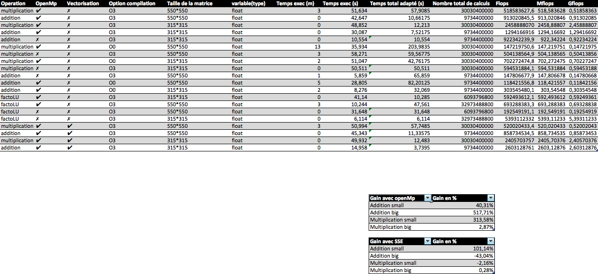

# MN - TP2 Compte rendu #
- NOGUERON Matthieu
- VIAL-GRELIER Aymeric

## Utilisation de l'application ##

    make
    ./target/debug/gen_aleat [nb elements][filename]
    ./target/debug/test_matrix_[small/big] [a/m/s/t/g (choix de l'opération)] [int (itérations)] [d/f (double/float)]

Afin d'éffectuer un test des performances de l'application un script .sh est à disposition. Pour l'éxécuter ./script_perfs.sh. Afin de personaliser les tests il est possible de changer les valeurs des itérations dans le script .sh.

    ADD_LOOP=X (valeur souhaitée d'itérations / par défaut 100 000);
    MULT_LOOP=Y (valeur souhaitée d'iterations / par défaut 500);

Ce script compile tout seul l'application et la lance afin de faire les tests sur :
  1. addition / openmp / matrices en cache / -O0
  2. addition / openmp / matrices pas en cache / -O0
  3. addition / openmp / matrices en cache / -O3
  4. addition / openmp / matrices pas en cache / -O3
  5. addition / pas openmp / matrices pas en cache / -O3
  6. addition / pas openmp / matrices en cache / -O3
  7. multiplication / openmp / matrices en cache / -O0
  8. multiplication / openmp / matrices pas en cache / -O0
  9. multiplication / openmp / matrices en cache / -O3
  10. multiplication / openmp / matrices pas en cache / -O3
  11. multiplication / pas openmp / matrices pas en cache / -O3
  12. multiplication / pas openmp / matrices en cache / -O3

Ce script génère en outre un fichier perfs.txt ressemblant à ceci :

Ceci permet en outre d'avoir une vue d'ensemble sur les différentes options et constater la différence entre les résultats.

## Présentation de la machine de tests
Voici la machine utilisée lors des tests :

## Présentation des résultats sur matrices
Voici les résultats obtenus pour les matrices avec la machine présentée ci-dessus.

